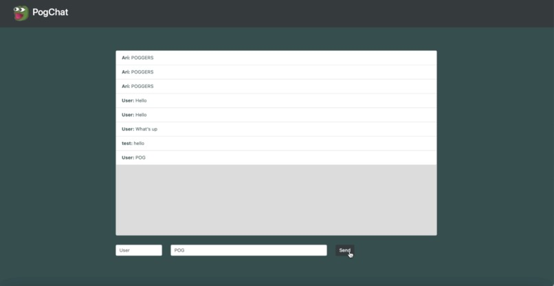
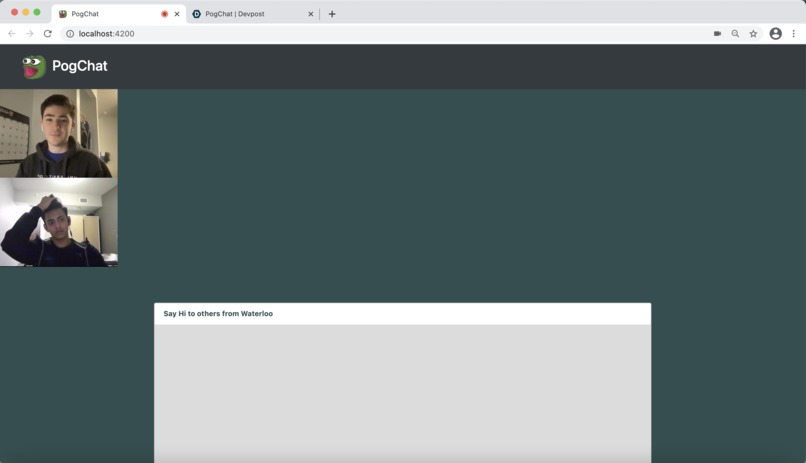

# Demo
## Mobile Demo

## Desktop Demo

## Video Chat Demo

# Inspiration
We were inspired to create PogChat to address our innate need for being heard in a crowd. When in an area with hundreds, even thousands of people, it becomes a challenge to try and broadcast that one _really funny_ joke you'd like to tell. Livestream apps like Twitch.tv are different - different in the sense that the crowd is fully virtual and anyone can see a message as long as they have one thing in common; that they watch the same stream 

PogChat was initially inspired by an old Nintendo DS program called Pictochat, where you can send and receive messages in a chatroom based on user proximity. We wanted to take the fundamental idea of Pictochat, incorporate the streaming community aspects that Twitch.tv conveys, then package it all neatly into a web app.
# What it does
PogChat lets the user text anyone within a 2-mile radius to simulate a real life Twitch chat. Anyone can send a message to the public chat room, but the user can only see messages within two miles to keep the chat relevant to that area. This lets one user communicate to a humongous amount of people without hopelessly attempting to raise their voice in a crowd.

In an audience/crowd setting such as a football game, you can use PogChat to tell anyone in the field to start a chant, start a wave, or simply tell a joke. In a non-crowd setting, PogChat can be used to meet and talk to people in your area without needing to see them in person - this proves very useful for the circumstances we find ourselves in now.

Additionally, we implemented a video call feature so you can talk to people within a two mile radius face-to-face. When a user enters the video call feature, they will immediately see the faces of any other nearby video calling users. This works similarly to a global facetime, the difference being that the location is restricted.

# How we built it
From bottom to top, we used a variety of software development practices to get this app going. To begin, using git for version control proved incredibly useful. Through git workflow, we were able to delegate tasks and modularize our project to guarantee smooth collaboration.

The app itself is powered by a CockroachDB database, which we use to store data regarding users and their text interactions, as well as their location data. The geolocation data was made possible through CockroachDB GIS capability. All messages are sent from an Angular.js frontend to a Flask backend, then immediately stored into a cloud database alongside identifiers and geocoded location data. To retrieve these messages and display into the chat, messages are grabbed from the database in real-time and filtered according to their location data. If the message originated from a spot a suitable distance away from a possible receiver, the message is displayed to this certain client. This method is implemented for each client in tandem.

As for the videocall functionality, the OpenTok Vonage API was used to generate video sessions on the condition that one does not already exist in the specified area. If a user would like to begin video chatting without a valid session in their area, a session is created, stored into the database, and tokens are then procedurally generated for each user that'd like to attend the video call.
# Challenges we ran into
The biggest source of problems for us was GIS, running geospatial queries proved more difficult than initially thought. Further, efficiency stood in the way of a great app. We had to simplify the database structure as much as possible, with queries and endpoints that only returned the bare minimal data needed, to get the app to perform at the required speed. Like any challenge, the hardest one was the most satisfying, and video chat really had our heads scratching. Luckily, we were able to identify the potential of Vonage API and its architecture. With a bit of tinkering, we were able to identify a reliable system that extends the Vonage API to provide location-based open video chat. Overall, we had a ton of work over the past 36 hours, but we learned a ton and had a ton of fun!
# Accomplishments that we are proud of
We are proud that we could create a finished product and expand on our idea more than what we had originally planned, (video chatting was not in the original plan, but the Vonage API changed that). We're very proud of our slick front-end, as well as our capable back-end, especially the ability to creatively apply CockroachDB's geospatial queries and the Vonage API. Above all, we're proud of creating a product that we genuinely believe brings joy. 
# What we learned
We learned new frameworks like CockroachDB, Angular, Flask, alongside the Vonage Python SDK - as well as how to combine them into one final working product.

# What's next for PogChat
Moving forward, we would like to publish this app on the App Store and Google Play Store, as well as deploy it as a web app. Before we publish it, we need to fix bugs and make the app a little easier to use, but as an MVP, we believe this is a very viable product. 